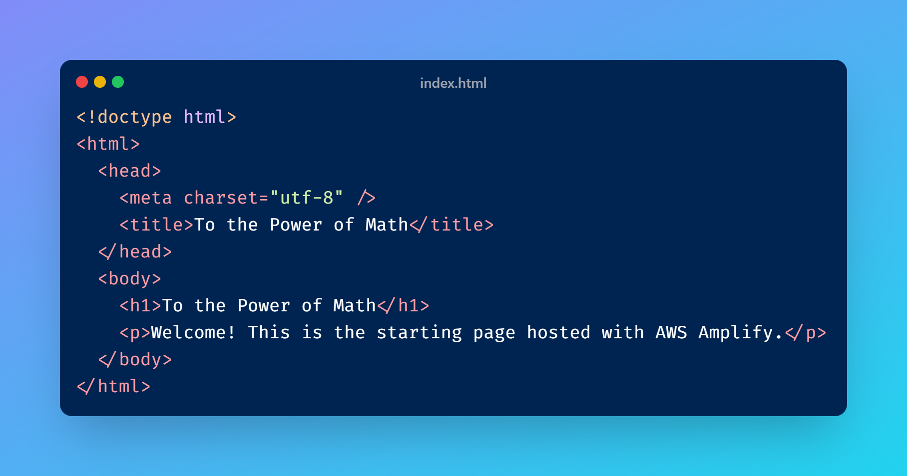

# Project Title : 
Architect and Build an End-to-End AWS Web Application from Scratch

# Project Description: 
This project is a simple web application that calculates an exponent — given a base number and an exponent, it returns the result (base^exponent). While the functionality is intentionally minimal, the purpose of the project is to demonstrate how different AWS services can be tied together into a complete, shareable, end-to-end application.

The app showcases how to:
- Host a static website with AWS Amplify,
- Expose a serverless API through API Gateway,
- Run backend logic with AWS Lambda (Python),
- Persist data in a DynamoDB NoSQL database, and
- Manage secure access with IAM permissions.

# Prerequisites
- AWS account with console access.
- Basic AWS knowledge (Lambda, API Gateway, DynamoDB).
- Text editor (VS Code, Notepad++).
- Python 3.9+ (for Lambda).
- Zip utility (to compress HTML for Amplify).

# Step-by-Step Guide: 

## Create and host the web page:

- Create a simple `"index.html"` file with the following code : 

- Zip the file :

- Go to the `AWS Amplify` page and select `Deploy without Git` 

- Provide the app name and the branch name 

- Scroll down a little bit and upload the Zip file 

- Wait for a moment , and we can see that the website is deployed. 

- We can click on the link provided and it redierects us to the website . 

## Create the Lambda function: 

- Go to `AWS Lambda>Functions`

- Create a function : 

- We can see that the function is created successfully . 

- We now add the code from this file and deploy the function:

[lamba-function](lambda-func.py) 

## Test the lambda function : 

- Navigate to the `Test` tab : 

- Create a new event and give it a name : 

- Edit the `Event Json` : 

- Hit `Test`

- We can check the result and see that it is as expected. 

