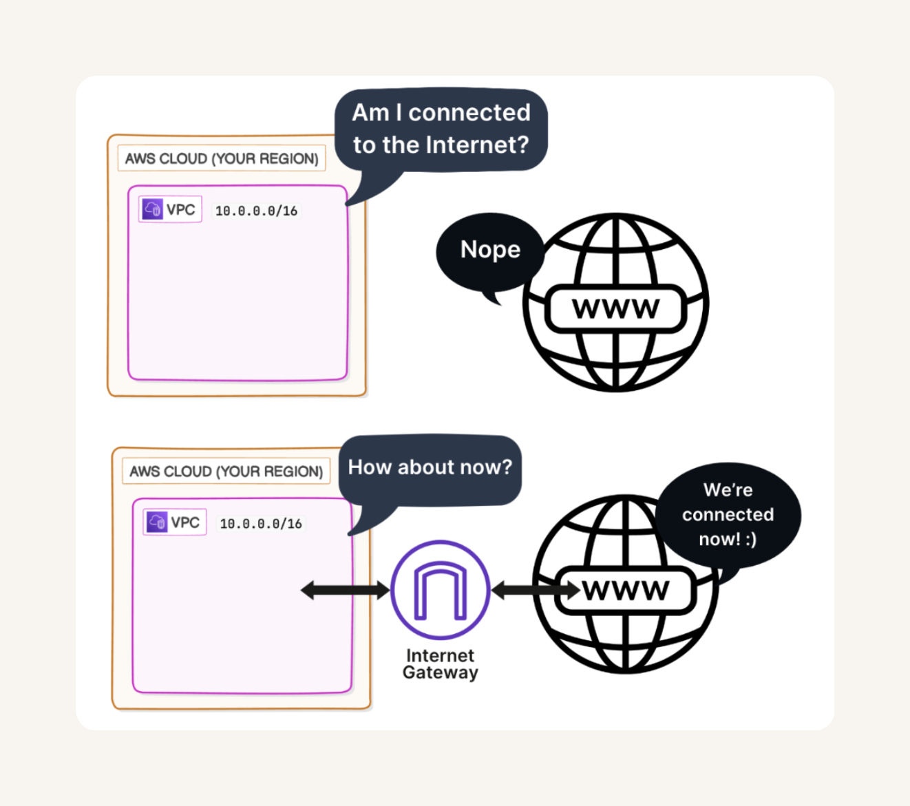

# VPC
An **AWS Virtual Private Cloud (VPC)** is a logically isolated section of the Amazon Web Services cloud where you can launch and manage AWS resources such as EC2 instances, databases, and load balancers in a secure and controlled environment.  It allows you to define your own IP address ranges, create subnets, and configure route tables, network gateways, and security settings to control inbound and outbound traffic. 

# Default VPC in every AWS account : 

A **default VPC** is automatically created in every new AWS account so that users can quickly start launching and connecting resources without having to set up networking from scratch.  This setup is meant for simplicity and ease of use, making it ideal for beginners or test environments.  However, for production workloads, organizations usually create custom VPCs to have finer control over IP ranges, security, and network segmentation.

# IP Address: 

An IP address (Internet Protocol address) is a unique numerical identifier assigned to every device connected to a network, enabling it to communicate with other devices over the internet or a local network.   They can be categorized as public (used on the internet) or private (used within internal networks), and static or dynamic, depending on whether they remain fixed or change over time.

# IPv4

IPv4 (Internet Protocol version 4) is the fourth version of the Internet Protocol and the most widely used system for identifying devices on a network. It uses a 32-bit addressing scheme, which allows for around 4.3 billion unique IP addresses, written in the familiar dotted-decimal format (e.g., 192.168.0.1).

# CIDR Block

A CIDR block (Classless Inter-Domain Routing block) is a method of defining IP address ranges more flexibly.   CIDR uses a combination of an IP address and a suffix that indicates how many bits are used for the network portion (e.g., 192.168.1.0/24).   The “/24” means the first 24 bits are the network identifier, leaving the remaining 8 bits for host addresses, which provides 256 total IPs (254 usable).

# Subnets

A subnet (subnetwork) is a smaller, logical division of a larger network or VPC that helps organize and manage IP address allocation more efficiently.  
Each subnet resides within a single Availability Zone in AWS, ensuring high availability and fault isolation. Subnets also allows us to apply specific routing rules and security controls, giving us fine-grained control over how traffic flows between different parts of our network.

# Internet Gateway: 

An Internet Gateway (IGW) is a horizontally scaled, highly available AWS component that allows resources within a VPC, such as EC2 instances in public subnets, to communicate with the internet.

